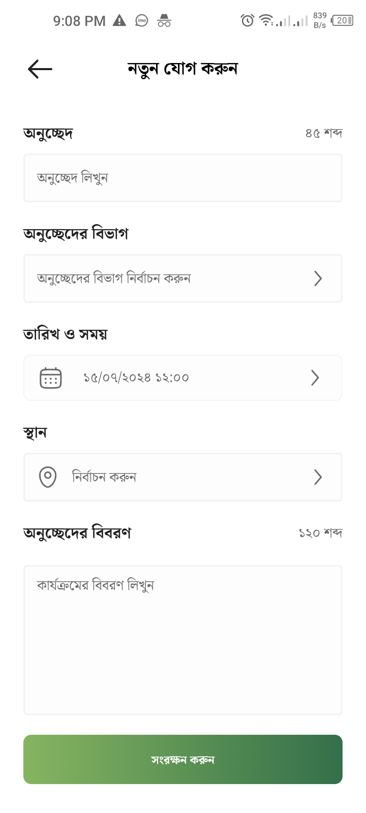

# SoftBD Ltd. Flutter Assesment Task
## Project Owner
This project is owned and maintained by *** S.M. Mozammel Hossain Imon ***.

## Description
Experience of Flutter Assessment Task, meticulously crafted with attention to design fidelity and responsiveness. This assesment task highlights comprehensive component functionality and effective date management, integrating API data seamlessly. It sets a high bar for a fully functional, user-centered application.

## Key Features
- **State Management Provider:** Utilizing the "GetX" and "RxDart" packages, we ensure efficient state management with reactive programming, delivering smooth data flow and clear separation of concerns.

- **Clean Code with Detailed Comments:** This codebase boasts clean and well-organized code, complemented by detailed comments for enhanced readability and maintainability, streamlining the development process.

- **Functionality Evaluation:** The project is assessed on its completeness and operational excellence, including effective date management displaying 7 previous and 7 upcoming days, seamless API integration to fetch and update data based on the selected date, and the use of relevant demo data and Ensuring the project is as fully functional as possible is key, reflecting your ability to deliver a fully functional application aligned with your experience and expectations.

- **Model Classes for Data Management:** Harnessing model classes, we optimize data storage and circulation, delivering a seamless user experience.

- **Modern UI Effects:** Enjoy the elegance of Modern UI effects that elevate the app's visual appeal.

## Screenshots

|                          Home Screen                          |                     Paragraph Screen                     |                          Add New Paragraph Screen                           |                 Show The Popup                 |
|:--------------------------------------------------------------:|:--------------------------------------------------------------:|:--------------------------------------------------------------:|:--------------------------------------------------------------:|
|  |  |  |  |

|                    Profile Screen                    |                  Notification Screen                  |                      Humbarger Menu                       |                         Video                          |
|:--------------------------------------------------------------:|:--------------------------------------------------------------:|:--------------------------------------------------------------:|:--------------------------------------------------------------:|
|  |  |  | <video width="auto" height="400" controls>
  <source src="video/video.mp4" type="video/mp4">
</video> |

## Installation
1. Clone the repository: `git clone https://github.com/sm-mozammal/flutter_task`
2. Install dependencies: `flutter pub get`
3. Run the app: `flutter run`

## Contributing
Contributions are welcome! If you have any suggestions, bug reports, or feature requests, please open an issue or submit a pull request.